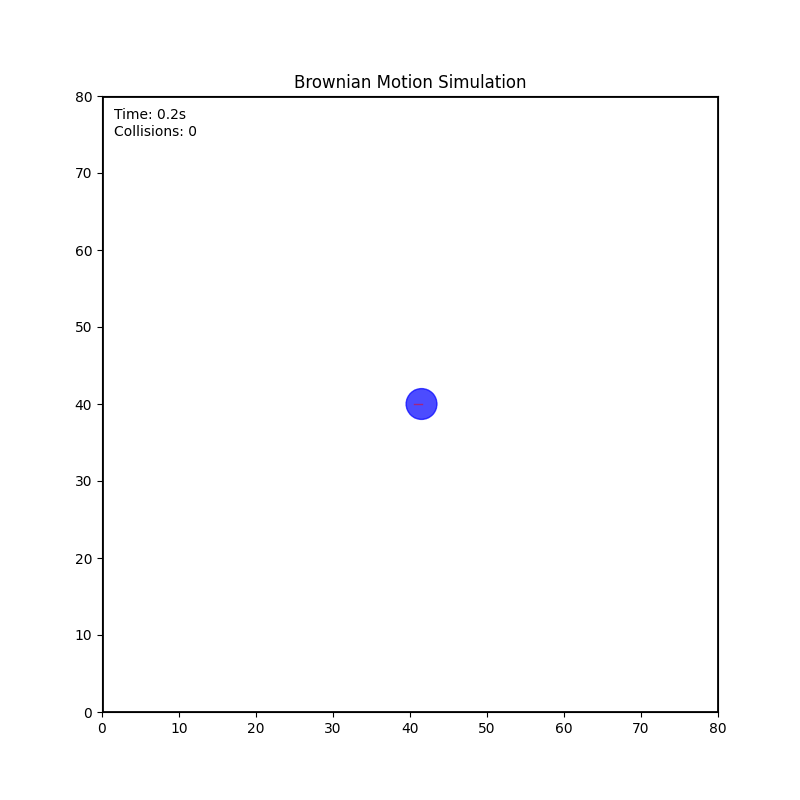

# Brownian Motion Robot Simulation

This project simulates a robot exhibiting Brownian motion behavior within a square arena. The robot moves forward until it collides with the arena boundaries, then rotates for a random duration before continuing its movement.

## Features

- Robot moves in a straight line until collision with arena boundaries
- Upon collision, robot rotates for a random duration (0.5-2.0 seconds)
- Visualization shows the robot's path and collision count
- Configurable arena size, simulation duration, and other parameters
- Animation can be saved as GIF for demonstration

## Requirements

- Python 3.6+
- NumPy
- Matplotlib

## Installation

1. Clone the repository:
   ```bash
   git clone https://github.com/Transcendental-Programmer/jde-test-python.git
   cd jde-test-python
   ```

2. Install dependencies:
   ```bash
   pip install -r requirements.txt
   ```

## Usage

Run the simulation with default parameters:

```bash
python run_simulation.py
```

### Command-line Options

- `--duration`: Simulation duration in seconds (default: 30)
- `--arena-size`: Size of the square arena (default: 100)
- `--save`: Save the animation to a file (e.g., 'animation.gif')
- `--trail-length`: Length of the trail showing robot's path (default: 100)

Example:

```bash
python run_simulation.py --duration 20 --arena-size 80 --save brownian_motion.gif
```

## Project Structure

- `brownian_robot/`: Main package
  - `__init__.py`: Package initialization
  - `robot.py`: Robot implementation with Brownian motion behavior
  - `simulation.py`: Simulation environment
  - `visualizer.py`: Visualization using Matplotlib
- `run_simulation.py`: Sample application to demonstrate the simulation

## Example Results

When you run the simulation, you'll see a visualization like this:



The blue circle represents the robot, and the red line shows its path. The display also shows the elapsed time and number of collisions.

## License

MIT

